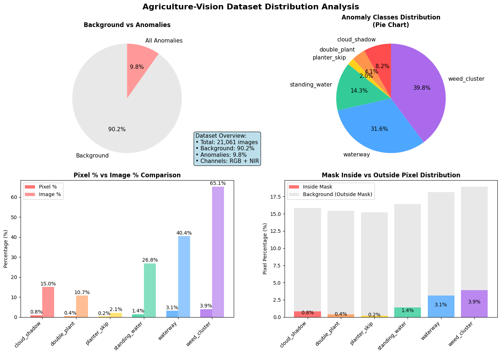

# 🌾 AgriSight
## SegFormer를 활용한 농지 위성 이미지 기반 이상 탐지 및 시각화

### 목표
농업용 위성 이미지에서 고르지 않은 작물 분포나 비정상 지역을 세분화하여 탐지하고, 이를 바탕으로 작업자의 농작업 의사결정을 지원하는 정밀 농업 시스템 개발

### 활용 목적
- 특정 질병 또는 생육 불량 지역을 조기 인지하여 수확 및 방제 계획 수립 시 작업자에게 보조 정보 제공
- 장비/시비 오류로 인한 파종 누락(Planter Skip), 이중 파종(Double Planting) 감지
- 농지 침수(Standing Water), 잡초 번식 지역(Weed Cluster) 식별을 통한 현장 경고 및 정밀 점검 우선순위 부여

---

## 모델 선정 이유

**SegFormer-B0**는 Transformer 기반 시맨틱 세그멘테이션 모델로, 적은 파라미터에도 불구하고 장거리 의존성 인식 능력과 해상도 강건성이 뛰어나 잡음 많은 농업 이미지에 효과적이다. CNN 기반 모델 대비 클래스 경계 인식에 유리하며, 클래스 불균형에도 비교적 안정적인 학습이 가능해 실제 응용 가능한 경량화된 모델 프로토타입으로 적합하다.

**구조적 특성:**
- **인코더**: Mix Transformer (MiT) - 계층적 Transformer 구조
- **디코더**: Lightweight MLP decoder - 간단한 MLP 구조
- 다양한 해상도 입력에 강하고, CNN에 비해 장거리 의존성 패턴 인식이 우수하여 잡음 많은 위성 이미지에 적합
- 적은 파라미터 수로도 높은 표현력을 가지며, 농업 이미지처럼 노이즈가 많고 불균형한 데이터에서 더 안정적으로 학습 가능

**기대 효과:**
- 기존 CNN 기반 세그멘테이션 대비 클래스 간 경계 인식 능력 향상
- 클래스 불균형 상황에서도 성능 저하 최소화
- 실제 농업 데이터셋에서 적용 가능한 경량화된 모델 프로토타입 구축

---

## 데이터셋: Agriculture Vision

**데이터셋 개요:**
Agriculture-Vision은 미국 퍼듀대학교(Purdue University) 농업 및 생명공학과에서 정밀 농업 및 농업 자동화 연구를 위해 수집한 다중 스펙트럼 위성 영상 기반 시맨틱 세그멘테이션 데이터셋.

**데이터 구성:**
- 총 약 94,000개의 512x512 크기 이미지 패치
- 각 이미지: RGB + NIR (4채널 입력)
- 총 6개 이상 클래스:
  Cloud Shadow, Double Planting, Planter Skip, Standing Water, Waterway, Weed Cluster
- 클래스 간 불균형 심각 / 배경 비율이 90% 이상
- 학습 시 클래스 콜랩스, 편향된 예측 위험 → 손실 함수 조정 및 샘플링 전략 필요

   

  

 

**데이터 특성 시각화 설명:**

- 배경 비율의 압도적 우세 (그래프 1)
  대부분의 이미지에서 배경이 전체 픽셀의 대다수를 차지함. 이는 시맨틱 세그멘테이션에서 네트워크가 비정상 클래스 학습보다 배경 예측에 과적합될 위험이 있음을 시사함.

- 클래스 간 심한 불균형 (그래프 2)
  일부 클래스는 전체 이미지 중 극소수만 포함하며, 데이터셋 전체에서 특정 클래스가 지나치게 적은 수로 존재함. 이로 인해 학습 편향 및 미탐지 위험이 존재함.

- 픽셀 단위 클래스 존재량 (그래프 3)
  이미지 기준으로 클래스가 포함되었는지만 보면 클래스들이 많이 포함된 듯 보이나, 실제 픽셀 기준으로 보면 대부분 클래스들이 극소수 영역에만 존재함. → 실제 마스크는 극히 작고 미약함.

- 마스크 내 클래스 비율 (그래프 4)
  배경을 제외한 실제 마스크 내부에서조차 특정 클래스(예: Waterway, Weed Cluster)에 쏠림이 심함. → 마스크 영역도 클래스 불균형이 그대로 유지되어 세밀한 분류가 필요함.

---

## 실험

### 모델: SegFormer-B0
- 사전 학습된 SegFormer-B0 사용
- 구조: Mix Transformer 인코더 + lightweight MLP 디코더

### 적용 기술
- 입력 채널 확장 (4채널 RGB+NIR 대응)
- **커스텀 클래스 가중치**: 농업적 중요도와 출현 빈도 기반 동적 가중치 설정
- Tversky + Focal Loss 조합 (클래스 불균형 해결)
- Reflective padding으로 경계 학습 오류 보완
- **농업 위성 이미지 특화 데이터 증강**:
  - 드론 촬영 환경 변화 시뮬레이션 (위치, 고도, 방향 변동)
  - 농업 현장 조명 변화 대응 (구름, 시간대별 밝기/대비 조정)
  - 4채널(RGB+NIR) 특화 ChannelDropout 및 노이즈 처리
  - 위성 이미지 해상도 및 픽셀 손실 시뮬레이션

---

## 실험 설계

### 학습 환경
- 장비: NVIDIA A100 (주), T4 (보조), M3 환경
- 프레임워크: PyTorch + PyTorch Lightning
- 개발 환경: Jupyter Notebook
- 로깅: TensorBoard, CSVLogger

### 하이퍼파라미터
- **학습 설정**:
  - Batch Size: 64 (A100 80GB 기준)
  - Image Size: 256×256
  - Max Epochs: 30
  - Learning Rate: 3e-4
- **Optimizer: AdamW (차등 학습률)**:
  - Encoder: 기본 학습률 × 0.1 (사전학습 가중치 보존)
  - Decoder: 기본 학습률 (새로 학습)
  - Weight Decay: Encoder 1e-4, Decoder 1e-3
- **LR Scheduler**: Warmup (100 steps) + CosineAnnealing (30 epochs)
- **학습 최적화**:
  - Mixed Precision: 16-bit
  - Gradient Accumulation: 4 batches
  - Gradient Clipping: 1.0
  - Validation Interval: 0.25 (에포크당 4회)

### 손실 함수 설계
- **Combined Tversky + Focal Loss**:
  - Tversky 비중: 0.7, Focal 비중: 0.3
  - Tversky alpha: 0.2 (FN 페널티 증가로 recall 향상)
  - Tversky beta: 0.8 (precision 중시)
  - Focal gamma: 2.5 (hard example 집중)

### 클래스 불균형 해결
- 극희귀 클래스 (planter_skip 2.1%) 강력 부스팅 (가중치 ~2.0)
- Dominant 클래스 (weed_cluster 68.9%) 억제 (가중치 ~0.9)
- 농업적 중요도 × 역빈도 가중치 기반 동적 계산
- 0.8~2.2 범위 제한으로 학습 안정성 확보

### 모델 설정
- **백본 모델**: nvidia/segformer-b0-finetuned-ade-512-512
- **사전 학습**: ADE20K 데이터셋 기반
- **입력 채널 확장**: RGB+NIR 4채널 대응
- **출력 클래스**: 6개 농업 이상 클래스

---

## 결과 및 분석

### 평가 메트릭
- 주요 지표: mIoU (mean Intersection over Union), Class-wise IoU
- 보조 지표: F1-Score (클래스별)
- Threshold: 0.5 (sigmoid 출력 기준)

---

## 스킬 스택
**Python**, **PyTorch**, **PyTorch Lightning**, **Albumentations**, **OpenCV**, **Transformers (HuggingFace)**, **TorchMetrics**, **Matplotlib**, **Numpy**, **Jupyter Notebook**
