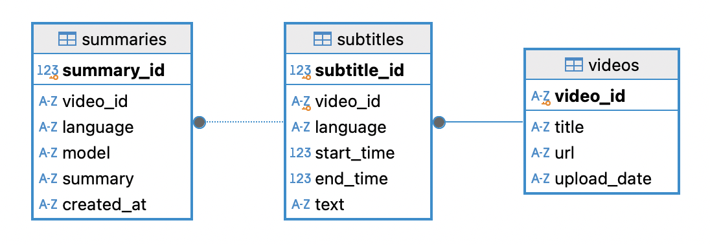
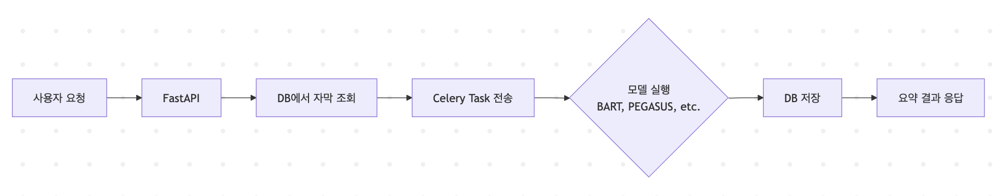

# 🧠 유투브 내용 정리기

Whisper 모델을 통해 유튜브 영상의 자막을 추출하고,  
BART·Pegasus로 요약, BERT·spaCy로 개체명 인식을 수행하여  
요약과 키워드를 웹 UI로 시각화합니다.

## 📁 프로젝트 구조
```
.
├── app/ # FastAPI 서버 + Celery
├── assets/ # 시연영상
├── data/ # 1분으로 줄인 유투브 영상
├── docker-compose.yml # Docker 전체 구성 파일
├── Dockerfile # Docker 설정 파일
├── package-lock.json # Node.js 고정 패키지 구성 파일
├── package.json # Node.js 스크립트 정의 패키지 구성 파일
├── requirements.txt # Python 의존성 목록 (pip 설치용)
├── scripts/ 전처리 코드
└── README.md
```

## ✅ 주요 기능
- Whisper로 자막(STT) 추출 (미국식/영국식 영어)
- BART·Pegasus 기반 요약 생성 및 성능 비교 (BARTScore)
- BERT·spaCy 기반 개체명 인식(NER)
- KeyBERT 기반 키워드 추출
- Celery 기반 비동기 백엔드 처리
- FastAPI 서버 REST API 제공
- Docker 기반 통합 실행 환경
- SQLite 기반 영상-자막-요약 관리


## ⚙️ 환경 요구 사항
- Python 3.9
- Node.js (NVM 22)
- Transformer 4.36.2
- moviepy 1.0.3
- Docker, Docker Compose


## 🔧 실행 방법 (Docker 기반)
```bash
docker-compose up --build
```
* 메인 페이지: http://0.0.0.0:8000


🗃️ DB 아키텍처

| 테이블       | 컬럼 구성                                        |
|------------|------------------------------------------------|
| subtitles  | video_id, language, start_time, end_time, text |
| videos     | video_id, title, url, upload_date              |
| summaries  | video_id, language, model, summary, created_at |




🧭 시스템 흐름도




## 📊 모델 비교 결과
| 영상 ID              | 모델     | BERTScore |
|----------------------|----------|-----------|
| UibfDUPJAEU (vid001) | BART     | 0.795     |
| UibfDUPJAEU (vid001) | PEGASUS  | 0.834     |
| Gzu9S5FL-Ug (vid002) | BART     | 0.529     |
| Gzu9S5FL-Ug (vid002) | PEGASUS  | 0.526     |


🐞 개발 중 겪은 이슈

- BART와 PEGASUS 모델을 동시에 로드하면 OOM 발생 → 최적의 결과 DB에 저장 후 로드
- BLEU보다 BERTScore가 요약 품질 구분에 더 적합하다고 판단
- 모델별 요약 편향이 영상마다 다름 → 결과 비교 필요
- 멀티 서버가 아닌 단일 서버에서 모델 분리 처리 고민


## 📄 라이선스
MIT License


## 📌 참고
    사전학습 모델:
        facebook/bart-large-cnn
        google/pegasus-large
        dslim/bert-base-NER
        en_core_web_sm
        sentence-transformers/all-MiniLM-L6-v2


## 📺 데모
[Watch demo video](./assets/demo.mp4)
