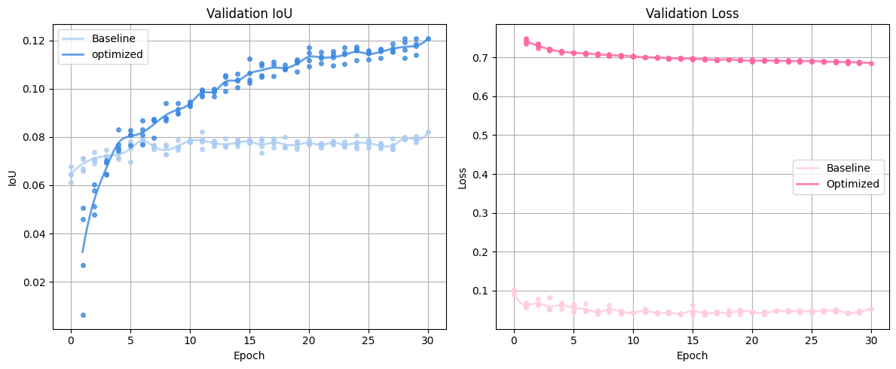

# 🌾 AgriSight
## SegFormer를 활용한 농지 위성 이미지 기반 이상 탐지 및 시각화

### 목표
농업용 위성 이미지에서 고르지 않은 작물 분포나 비정상 지역을 세분화하여 탐지하고, 이를 바탕으로 작업자의 농작업 의사결정을 지원하는 정밀 농업 시스템 개발

### 활용 목적
- 특정 질병 또는 생육 불량 지역을 조기 인지하여 수확 및 방제 계획 수립 시 작업자에게 보조 정보 제공
- 장비/시비 오류로 인한 파종 누락(Planter Skip), 이중 파종(Double Planting) 감지
- 농지 침수(Standing Water), 잡초 번식 지역(Weed Cluster) 식별을 통한 현장 경고 및 정밀 점검 우선순위 부여

<br>

---

## 모델 선정 이유

**SegFormer-B0**는 Transformer 기반 시맨틱 세그멘테이션 모델로, 적은 파라미터에도 불구하고 장거리 의존성 인식 능력과 해상도 강건성이 뛰어나 잡음 많은 농업 이미지에 효과적이다. CNN 기반 모델 대비 클래스 경계 인식에 유리하며, 클래스 불균형에도 비교적 안정적인 학습이 가능해 실제 응용 가능한 경량화된 모델 프로토타입으로 적합하다.

**구조적 특성:**
- **인코더**: Mix Transformer (MiT) - 계층적 Transformer 구조
- **디코더**: Lightweight MLP decoder - 간단한 MLP 구조
- 다양한 해상도 입력에 강하고, CNN에 비해 장거리 의존성 패턴 인식이 우수하여 잡음 많은 위성 이미지에 적합
- 적은 파라미터 수로도 높은 표현력을 가지며, 농업 이미지처럼 노이즈가 많고 불균형한 데이터에서 더 안정적으로 학습 가능

**기대 효과:**
- 기존 CNN 기반 세그멘테이션 대비 클래스 간 경계 인식 능력 향상
- 클래스 불균형 상황에서도 성능 저하 최소화
- 실제 농업 데이터셋에서 적용 가능한 경량화된 모델 프로토타입 구축

<br>

---

## 데이터셋: Agriculture Vision

**데이터셋 개요:**
Agriculture-Vision은 미국 퍼듀대학교(Purdue University) 농업 및 생명공학과에서 정밀 농업 및 농업 자동화 연구를 위해 수집한 다중 스펙트럼 위성 영상 기반 시맨틱 세그멘테이션 데이터셋.

**데이터 구성:**
- 총 약 94,000개의 512x512 크기 이미지 패치
- 각 이미지: RGB + NIR (4채널 입력)
- 총 6개 이상 클래스:
  Cloud Shadow, Double Planting, Planter Skip, Standing Water, Waterway, Weed Cluster
- 클래스 간 불균형 심각 / 배경 비율이 90% 이상
- 학습 시 클래스 콜랩스, 편향된 예측 위험 → 손실 함수 조정 및 샘플링 전략 필요

<br>

  


**데이터 특성 시각화 설명:**

- 배경 비율의 압도적 우세 (그래프 1)
  대부분의 이미지에서 배경이 전체 픽셀의 대다수를 차지함. 이는 시맨틱 세그멘테이션에서 네트워크가 비정상 클래스 학습보다 배경 예측에 과적합될 위험이 있음을 시사함.

- 클래스 간 심한 불균형 (그래프 2)
  일부 클래스는 전체 이미지 중 극소수만 포함하며, 데이터셋 전체에서 특정 클래스가 지나치게 적은 수로 존재함. 이로 인해 학습 편향 및 미탐지 위험이 존재함.

- 픽셀 단위 클래스 존재량 (그래프 3)
  이미지 기준으로 클래스가 포함되었는지만 보면 클래스들이 많이 포함된 듯 보이나, 실제 픽셀 기준으로 보면 대부분 클래스들이 극소수 영역에만 존재함. → 실제 마스크는 극히 작고 미약함.

- 마스크 내 클래스 비율 (그래프 4)
  배경을 제외한 실제 마스크 내부에서조차 특정 클래스(예: Waterway, Weed Cluster)에 쏠림이 심함. → 마스크 영역도 클래스 불균형이 그대로 유지되어 세밀한 분류가 필요함.

<br>

---

## 실험

### 모델: SegFormer-B0
- 사전학습 모델: nvidia/segformer-b0-finetuned-ade-512-512
- 구조: Mix Transformer 인코더 + lightweight MLP 디코더
- 입력 채널: 4채널 (RGB+NIR)
- 출력 클래스: 6개 (Cloud Shadow, Double Planting, Planter Skip, Standing Water, Waterway, Weed Cluster)

### 주요 적용 기술 및 커스터마이징
- 클래스 가중치 동적 계산
  - 농업적 중요도 × 클래스 빈도 기반
  - 가중치 범위 제한: 0.8~2.2
- 손실 함수 커스터마이징
  - Tversky (α=0.2, β=0.8) + Focal (γ=2.5) 조합
  - 희귀 클래스 recall 개선, hard example 집중 학습
- Reflective padding
  - 경계 손실 방지로 성능 안정화
- 혼합 정밀도 학습 및 gradient clipping
  - 학습 안정성 및 메모리 최적화

### 데이터 증강 전략
농업 위성 이미지 특성에 맞춰 커스터마이징된 증강 구성:

| 목적 | 적용 기법 |
|---------|-----------|
| **드론 촬영 환경 변화**	| ShiftScaleRotate, RandomRotate90
| **조도/조명 변화** | RandomBrightnessContrast, GaussNoise
| **센서 오류 시뮬레이션** | ChannelDropout
| **압축 및 해상도 손실**	| Downscale, JPEGCompression
| **전처리 및 텐서화** | Normalize, ToTensorV2

<br>

```
def get_train_transforms(image_size=(256, 256)):
    return A.Compose([
        # 리사이즈
        A.Resize(image_size[0], image_size[1], interpolation=cv2.INTER_NEAREST),
        
        # 기본 Geometric 증강 (농업 현실적 범위)
        A.HorizontalFlip(p=0.5),
        A.VerticalFlip(p=0.5),
        
        # 드론 촬영 현실적 변화 시뮬레이션
        A.ShiftScaleRotate(
            shift_limit=0.08,      # 드론 위치 미세 변화
            scale_limit=0.1,       # 고도 변화 (10% 이내)
            rotate_limit=5,       # 현실적인 회전 (5도 이내), 인위적인 검은 배경 최소화
            p=0.6,
            border_mode=cv2.BORDER_REFLECT_101
            # value=0,
            # mask_value=0
        ),
        
        # 농업 환경 특화 증강
        A.RandomBrightnessContrast(
            brightness_limit=0.15,  # 구름/그림자 효과
            contrast_limit=0.15,    # 대기 조건 변화
            p=0.4
        ),
        
        # 센서 노이즈 시뮬레이션
        A.GaussNoise(var_limit=(5, 20), p=0.25),
        
        # 4채널 특화: 일부 채널 드롭아웃 (NIR 센서 오류 시뮬레이션)
        A.ChannelDropout(
            channel_drop_range=(1, 1),  # 1개 채널만 드롭
            fill_value=0,
            p=0.1  # 낮은 확률로 적용
        ),
        
        # 작은 영역 드롭아웃 (잡음/가림 효과)
        A.CoarseDropout(
            max_holes=5,
            max_height=12,
            max_width=12,
            p=0.15,
            fill_value=0,
            mask_fill_value=0
        ),
        
        # 4채널용 정규화 (Agriculture Vision 데이터셋 통계 기반)
        A.Normalize(
            mean=[0.485, 0.456, 0.406, 0.408],  # NIR 채널 평균값 조정
            std=[0.229, 0.224, 0.225, 0.237]    # NIR 채널 표준편차 조정
        ),
        ToTensorV2(),
    ])
```

<br>

### 손실 함수 설계
- 희귀 클래스에 대한 recall 향상과 hard example에 대한 집중 학습을 위해 Tversky + Focal Loss를 조합한 커스텀 손실 함수를 사용하였다.
  - Tversky는 FN(누락)에 높은 페널티를 부여하여 recall을 향상시키고
  - Focal은 어려운 샘플에 집중하도록 설계됨
  - 클래스 불균형 문제를 완화하기 위해 class weight를 추가 반영함

<br>

```
  self.combined_loss = CombinedTverskyFocalLoss(
      tversky_weight=0.7,     # Tversky 비중 증가
      focal_weight=0.3,       
      tversky_alpha=0.2,      # FN 페널티 증가 (recall 향상)
      tversky_beta=0.8,       
      focal_alpha=1.0,
      focal_gamma=2.5,        # hard example 집중
      class_weights=self.class_weights
  )
```

- 클래스 가중치는 클래스 빈도 × 농업적 중요도로 동적으로 계산하며, 0.8 ~ 2.2 사이로 제한함.

<br>

### 실험 설계 비교

| 구성요소 | 베이스라인 | 최적화 모델 | 개선 효과 |
|---------|-----------|------------|----------|
| **Loss** | CrossEntropy + Class Weight | Combined Tversky(0.7) + Focal(0.3) | 희귀 클래스 탐지 향상 |
| **Optimizer** | AdamW (단일 LR: 1e-3) | AdamW (Encoder×0.1, Decoder 기본) | 사전훈련 가중치 보존 |
| **Scheduler** | StepLR | Warmup + CosineAnnealing | 학습 안정성 및 수렴 |
| **Augmentation** | Flip만 | 농업 특화 증강 (센서 노이즈, 드론 변화) | 일반화 성능 향상 |
| **Training** | 기본 설정 | Mixed Precision + Gradient 최적화 | 학습 효율성 |

<br>

---

## 결과 및 분석

### 평가 지표
- 주요 지표: **mIoU**, **클래스별 IoU**
- 보조 지표: **F1-Score**
- 출력 임계값: 0.5 (sigmoid 기반 thresholding)

### 모델 저장 및 시각화
- 최고 성능 모델: checkpoints/best_model-epoch=15-val_iou=0.1124.ckpt 등
- 시각화 예시: outputs/vis/epoch15_sample23.png
  - 입력 이미지 / GT 마스크 / 예측 마스크 비교 시각화 가능

  

<br>

---

## 스킬 스택
**Python**, **PyTorch**, **PyTorch Lightning**, **Albumentations**, **OpenCV**, **Transformers (HuggingFace)**, **TorchMetrics**, **Matplotlib**, **Numpy**, **Jupyter Notebook**
