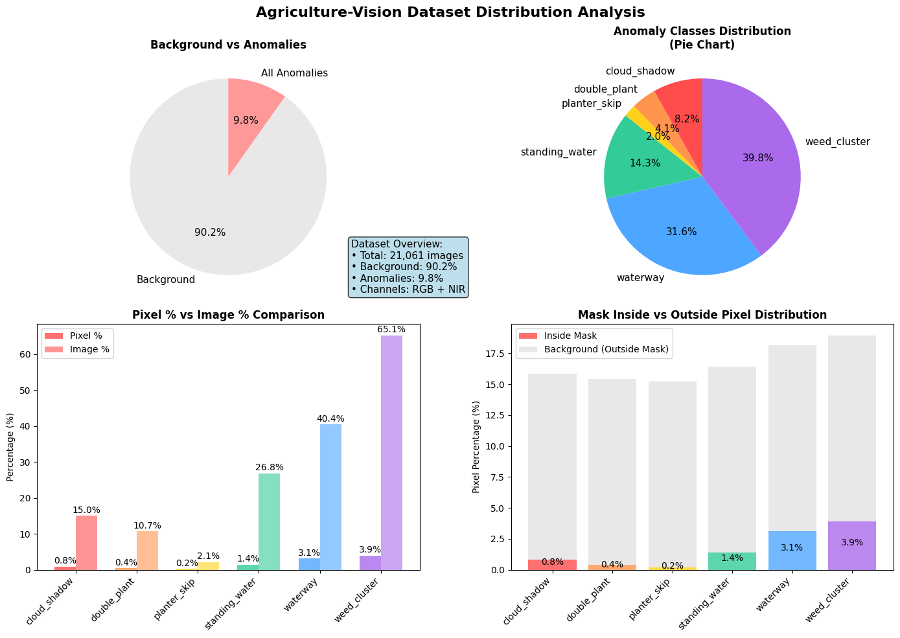
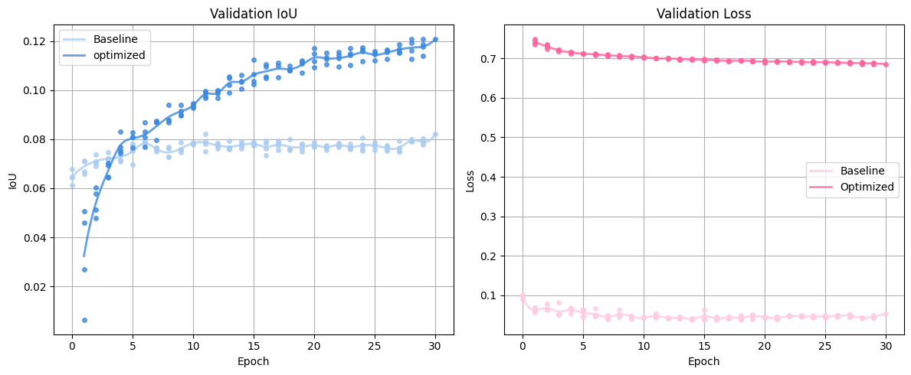
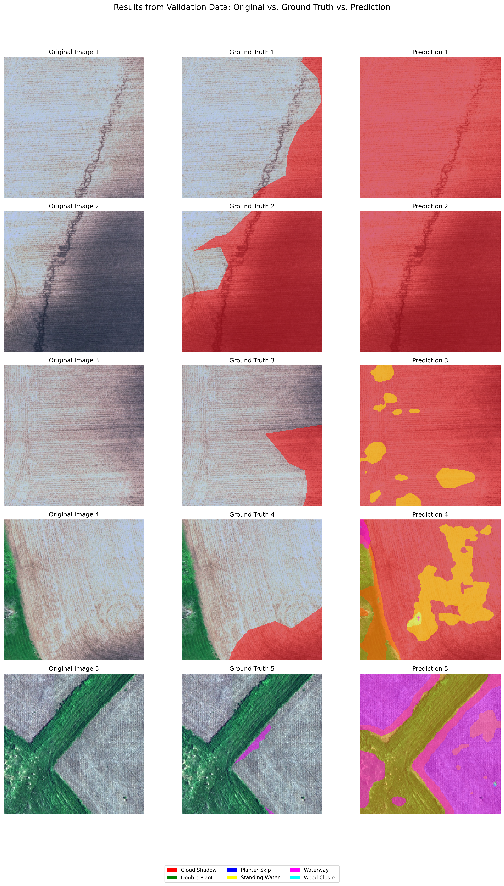
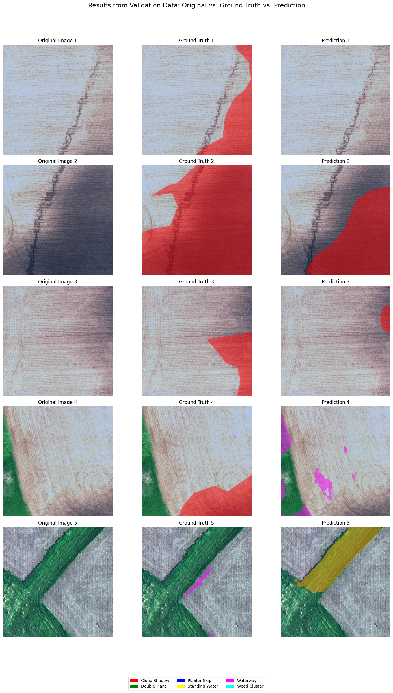
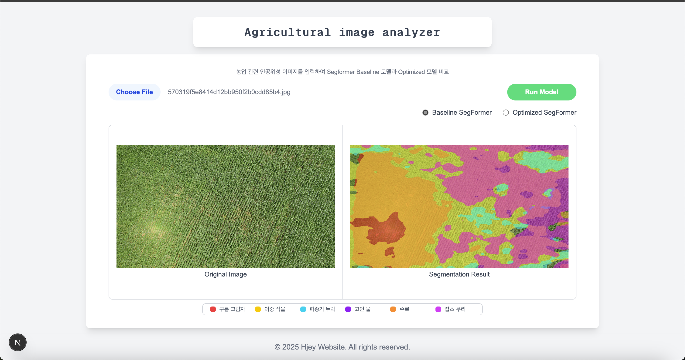
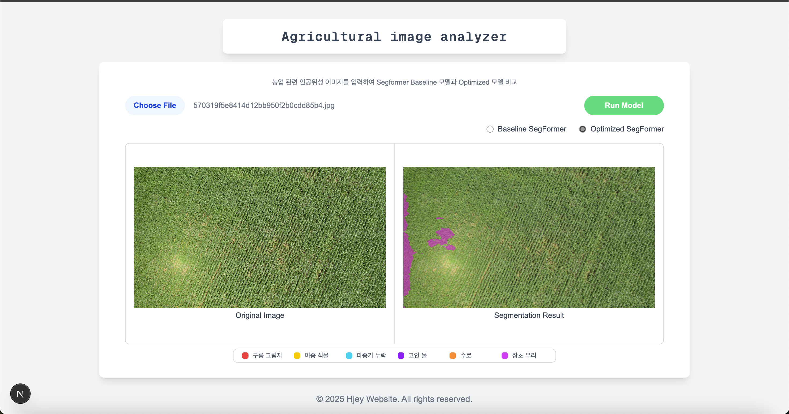

# 🌾 AgriSight

This is the English version of the README.

## 🌐 Other Languages
- [🇰🇷 한국어 설명 보기](README.kr.md)

## Anomaly Detection and Visualization of Farmland Satellite Imagery Using SegFormer

### Objective
Develop a precision agriculture system that supports decision-making by segmenting and detecting irregular crop distributions or abnormal regions in satellite imagery of farmland.

### Use Cases
- Early detection of crop diseases or poor growth areas to assist in harvest and pest control planning
- Identification of planter skips and double planting caused by equipment or fertilization errors
- Detection of standing water and weed clusters to prioritize field inspections and issue alerts

<br>

---

## Why SegFormer?

**SegFormer-B0** is a Transformer-based semantic segmentation model that excels in recognizing long-range dependencies and maintaining resolution robustness, even with a small number of parameters—making it highly effective for noisy agricultural imagery. Compared to CNN-based models, it offers superior class boundary recognition and handles class imbalance more stably, making it suitable as a lightweight prototype for real-world applications.

**Architectural Highlights:**
- **Encoder**: Mix Transformer (MiT) - hierarchical Transformer structure
- **Decoder**: Lightweight MLP decoder - simple and efficient
- Robust to varying input resolutions and better at capturing long-range patterns than CNNs
- High expressiveness with fewer parameters, enabling stable learning on noisy and imbalanced agricultural data

**Expected Benefits:**
- Improved boundary recognition between classes compared to CNN-based segmentation
- Minimized performance degradation under class imbalance
- Lightweight model prototype applicable to real agricultural datasets

<br>

---

## Dataset: Agriculture Vision

**Overview:**
Agriculture-Vision is a multi-spectral semantic segmentation dataset collected by Purdue University’s Department of Agricultural and Biological Engineering for research in precision agriculture and automation.

**Composition:**
- ~94,000 image patches (512×512 resolution)  
- Each image includes RGB + NIR channels (4-channel input)  
- Over 6 classes:  
  Cloud Shadow, Double Planting, Planter Skip, Standing Water, Waterway, Weed Cluster  
- Severe class imbalance; background occupies over 90% of pixels  
- Risk of class collapse and biased predictions during training → requires loss function tuning and sampling strategies

<br>

  


**Visualization Insights:** 

- **Graph 1**: Dominance of background pixels  
  Most images are overwhelmingly composed of background, risking overfitting to background predictions.
  
- **Graph 2**: Severe class imbalance  
  Some classes appear in only a small fraction of images, increasing the risk of biased learning and missed detections.
  
- **Graph 3**: Class presence by pixel  
  While many images contain multiple classes, actual pixel coverage is minimal, resulting in sparse masks.
  
- **Graph 4**: Class distribution within masks  
  Even within non-background masks, certain classes (e.g., Waterway, Weed Cluster) dominate, requiring fine-grained classification.  

<br>

---

## Experiments

### Model: SegFormer-B0
- Pretrained: nvidia/segformer-b0-finetuned-ade-512-512
- Architecture: Mix Transformer encoder + lightweight MLP decoder
- Input: 4 channels (RGB+NIR)
- Output: 6 classes (Cloud Shadow, Double Planting, Planter Skip, Standing Water, Waterway, Weed Cluster)

### Key Techniques & Customizations  

- **Dynamic Class Weights**  
  - Based on agricultural importance × class frequency  
  - Weight range: 0.8–2.2  
- **Custom Loss Function**  
  - Combination of Tversky (α=0.2, β=0.8) and Focal (γ=2.5)  
  - Enhances recall for rare classes and focuses on hard examples  
- **Reflective Padding**  
  - Stabilizes performance by preventing edge loss  
- **Mixed Precision & Gradient Clipping**  
  - Improves training stability and memory efficiency  

### Data Augmentation Strategy  
Tailored for agricultural satellite imagery:

| Purpose | Techniques |
|--------|------------|
| **Drone Flight Variations** | ShiftScaleRotate, RandomRotate90 |
| **Lighting Conditions** | RandomBrightnessContrast, GaussNoise |
| **Sensor Error Simulation** | ChannelDropout |
| **Compression & Resolution Loss** | Downscale, JPEGCompression |
| **Preprocessing & Tensor Conversion** | Normalize, ToTensorV2 |

<br>

```
def get_train_transforms(image_size=(256, 256)):
    return A.Compose([
        A.Resize(image_size[0], image_size[1], interpolation=cv2.INTER_NEAREST),
        A.HorizontalFlip(p=0.5),
        A.VerticalFlip(p=0.5),
        A.ShiftScaleRotate(
            shift_limit=0.08,
            scale_limit=0.1,
            rotate_limit=5,
            p=0.6,
            border_mode=cv2.BORDER_REFLECT_101
            # value=0,
            # mask_value=0
        ),
        A.RandomBrightnessContrast(
            brightness_limit=0.15,
            contrast_limit=0.15,
            p=0.4
        ),
        A.GaussNoise(var_limit=(5, 20), p=0.25),
        A.ChannelDropout(
            channel_drop_range=(1, 1),
            fill_value=0,
            p=0.1
        ),
        A.CoarseDropout(
            max_holes=5,
            max_height=12,
            max_width=12,
            p=0.15,
            fill_value=0,
            mask_fill_value=0
        ),
        A.Normalize(
            mean=[0.485, 0.456, 0.406, 0.408],
            std=[0.229, 0.224, 0.225, 0.237]
        ),
        ToTensorV2(),
    ])
```

<br>

### Loss Function Design  
To improve recall for rare classes and focus on hard examples, a custom loss combining Tversky and Focal was used:

<br>

```
  self.combined_loss = CombinedTverskyFocalLoss(
      tversky_weight=0.7,
      focal_weight=0.3,       
      tversky_alpha=0.2,
      tversky_beta=0.8,       
      focal_alpha=1.0,
      focal_gamma=2.5,
      class_weights=self.class_weights
  )
```

- Class weights are dynamically calculated based on frequency × agricultural importance, constrained between 0.8 and 2.2.

<br>

### Experiment Comparison

| Component | Baseline | Optimized | Improvement |
|----------|----------|-----------|-------------|
| **Loss** | CrossEntropy + Class Weight | Tversky(0.7) + Focal(0.3) | Better rare class detection |
| **Optimizer** | AdamW (LR=1e-3) | AdamW (Encoder×0.1) | Preserves pretrained weights |
| **Scheduler** | StepLR | Warmup + CosineAnnealing | Stable convergence |
| **Augmentation** | Flip only | Agriculture-specific | Improved generalization |
| **Training** | Default | Mixed Precision + Gradient Clipping | Efficient training |


<br>

---

## Results & Analysis

### Evaluation Metrics  
- Primary: **mIoU**, **Class-wise IoU**  
- Secondary: **F1-Score**  
- Threshold: 0.5 (sigmoid-based)

| Metric | Baseline | Optimized |
|--------|----------|-----------|
| val_f1 | 0.2960   | 0.5031    |
| val_iou | 0.0823  | **0.1124** |
| val_loss | 0.0531 | 0.6945    |

### Model Saving & Visualization

  

- Best Models  
  - Baseline: epoch=11, mIoU=0.0823
  - Optimized: epoch=23, mIoU=0.1210

- Inference Comparison  

  **Baseline**
  

  **Optimized**
  

  > Left: Input / Center: Ground Truth / Right: Prediction

### Web Interface Output

**Class Legend**  
- ■ **cloud_shadow**: Cloud Shadow (Red)  
- ■ **double_plant**: Double Planting (Yellow)  
- ■ **planter_skip**: Planter Skip (Cyan)  
- ■ **standing_water**: Standing Water (Purple)  
- ■ **waterway**: Waterway (Orange)  
- ■ **weed_cluster**: Weed Cluster (Magenta)  

**Baseline Model**


**Optimized Model**  


---

## System Architecture

### Overview  
- **Frontend (Next.js)**: Image upload and segmentation visualization  
- **Backend (FastAPI)**: API gateway and routing  
- **ML Inference Server (FastAPI + ONNX)**: Real-time segmentation using SegFormer  
- **Redis**: Celery broker and caching  
- **Docker**: Microservice containerization  

### Key Features  
- Real-time image upload with support for various formats  
- Dual-model comparison: Baseline vs Optimized  
- **ONNX Optimization**: Faster inference via PyTorch → ONNX conversion  
- Visualization with color masks and class legends  

<br>

---

## Project Structure  
```
agrisight/
├── README.md
├── Makefile
├── docker-compose.yml
├── backend/
│   ├── main.py                # FastAPI 메인 서버
│   └── routes.py              # API 라우팅
├── frontend/
│   ├── src/app/page.tsx       # 메인 페이지
│   └── src/components/        # UI 컴포넌트
├── inference/
│   ├── app.py                 # 추론 서버 (ONNX)
│   ├── model.py               # SegFormer 모델
│   └── models/
│       ├── *.ckpt             # PyTorch 체크포인트
│       ├── *.onnx             # ONNX 모델
│       └── convert_to_onnx.py # 변환 스크립트
├── docker/                    # Dockerfile들
├── scripts/                   # 학습 노트북들
└── assets/                    # README 이미지
```
---

## Tech Stack

### ML & Backend  
- **PyTorch Lightning**, **ONNX Runtime**: Model training and inference  
- **FastAPI**: ML inference server  
- **HuggingFace Transformers**: Pretrained model integration  

### Frontend & DevOps  
- **Next.js + TypeScript**: Web interface  
- **Docker Compose**: Container orchestration  
---

## How to Run
```bash
# Start the system
make up

# Convert to ONNX (run once)
make convert-onnx

# Access the web interface
http://localhost:3000
```
---

## License

MIT License
